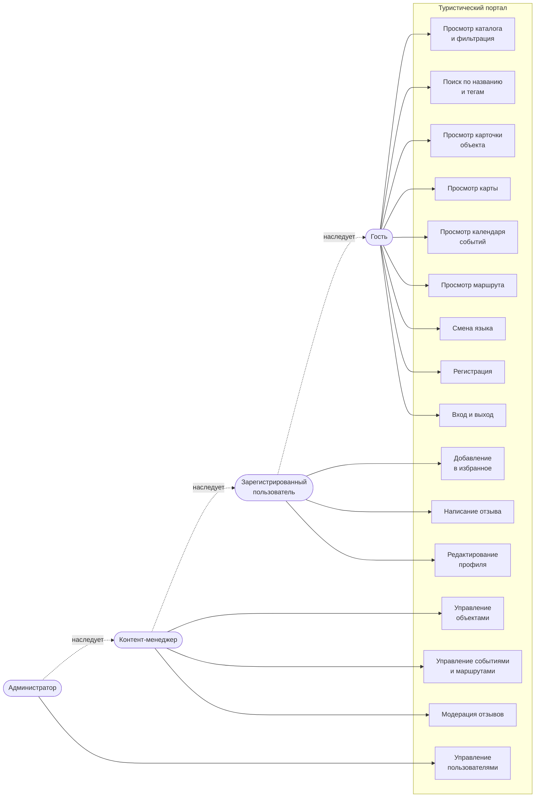

# Диаграмма вариантов использования

## Описание ключевых сценариев

### UC-1. Подбор объекта в каталоге

**Актор:** гость
**Предусловие:** каталог наполнен

1. Гость открывает «Каталог».
2. Выбирает категорию, село, сезон, при необходимости вводит запрос.
3. Нажимает «Показать».
4. Портал выводит подходящие объекты округа; объекты за границами округа —
   отдельным блоком «Рядом с округом».
5. Гость переходит в карточку объекта.

**Альтернативный ход:** ничего не найдено — портал показывает подсказку и
предлагает изменить фильтры.

### UC-2. Добавление в избранное

**Актор:** зарегистрированный пользователь
**Предусловие:** пользователь вошёл

1. Пользователь нажимает ♥ на карточке объекта или на его странице.
2. Портал сохраняет объект в избранное и подтверждает действие сообщением.
3. Объект появляется в разделе «Избранное».

**Альтернативный ход:** повторное нажатие убирает объект из избранного.
Если пользователь не вошёл, портал ведёт его на страницу входа и возвращает
обратно после авторизации.

### UC-3. Отзыв с модерацией

**Актор:** зарегистрированный пользователь, контент-менеджер

1. Пользователь на странице объекта заполняет оценку и текст отзыва.
2. Портал проверяет длину текста (не менее 20 символов) и сохраняет отзыв со
   значением `is_approved = false`.
3. Пользователь видит сообщение о том, что отзыв отправлен на модерацию; в
   личном кабинете отзыв помечен «на модерации».
4. Контент-менеджер открывает раздел «Отзывы» в панели управления,
   фильтрует по «Одобрен: нет» и применяет действие «Одобрить и опубликовать».
5. Отзыв появляется на странице объекта и учитывается в рейтинге.

**Ограничение:** один пользователь может оставить только один отзыв об
объекте (ограничение уникальности в базе).

### UC-4. Публикация нового объекта

**Актор:** контент-менеджер

1. Менеджер входит в панель управления.
2. Открывает «Туристические объекты» → «Добавить».
3. Заполняет название, категорию, село, координаты, описания и переводы.
4. Задаёт сезонность и статус; для недействующего или строящегося объекта
   обязательно заполняет «Примечание о достоверности».
5. Прикрепляет фотографии, отмечает обложку.
6. Ставит отметку «Опубликован» и сохраняет.
7. Объект появляется в каталоге, на карте и в поиске.

### UC-5. Просмотр портала на китайском языке

**Актор:** гость из КНР

1. Гость выбирает 中文 в переключателе языков в шапке.
2. Портал сохраняет выбор в сессии и перезагружает текущую страницу.
3. Интерфейс, названия объектов, краткие описания и маршруты выводятся
   по-китайски; при отсутствии перевода поле показывается по-русски.
