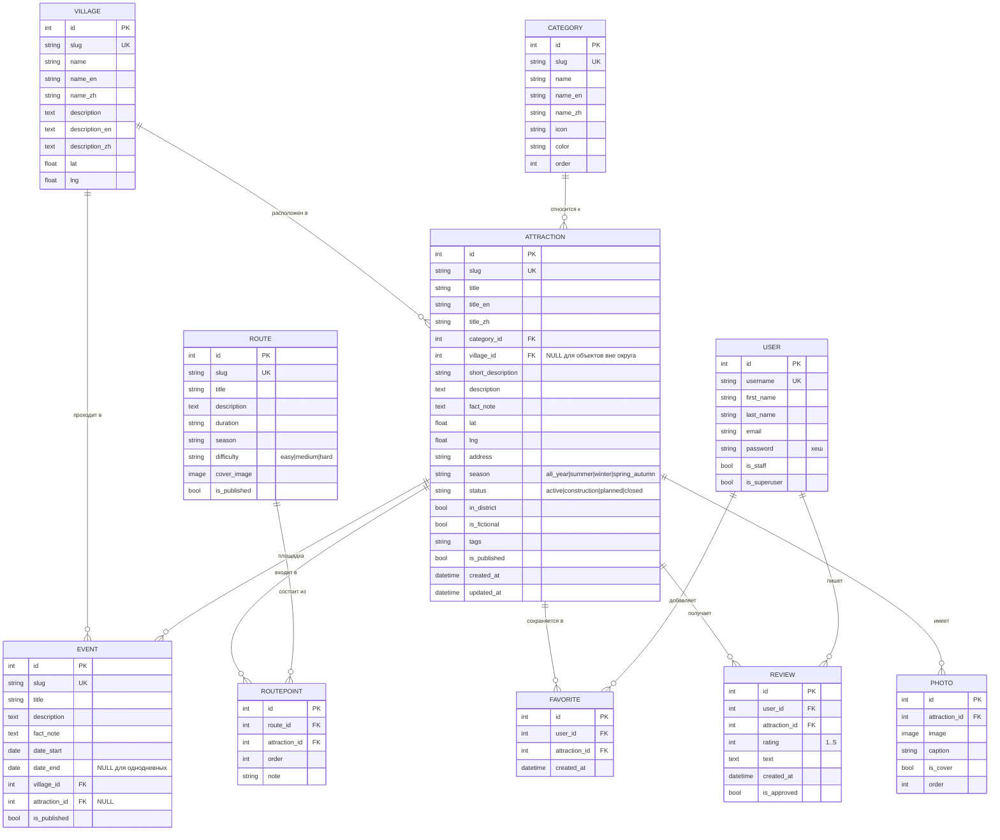

# ER-модель базы данных

## Пояснения к модели

### Многоязычность

Переводимые поля продублированы суффиксами `_en` и `_zh`. Это самый простой
для чтения вариант: одна запись — все языки, никаких дополнительных таблиц и
JOIN-ов. Метод `TranslatedFieldsMixin.tr()` выбирает версию по активному
языку и откатывается на русскую, если перевод пуст, поэтому страница никогда
не оказывается пустой.

Альтернатива для ВКР — библиотека `django-modeltranslation` или отдельная
таблица переводов; на текущем объёме они себя не окупают.

### Связь «многие-ко-многим» с порядком

`Route` и `Attraction` связаны через `RoutePoint`. Промежуточная таблица
нужна не только ради связи, но и ради двух собственных полей: `order`
(порядок следования, по нему рисуется линия на карте) и `note` (комментарий
именно для этой точки в этом маршруте).

### Ограничения целостности

| Ограничение | Смысл |
|---|---|
| `unique_route_attraction` (route, attraction) | объект не может входить в один маршрут дважды |
| `unique_user_attraction_review` (user, attraction) | один пользователь — один отзыв об объекте |
| `unique_user_attraction_favorite` (user, attraction) | объект добавляется в избранное один раз |
| `Attraction.category` → `PROTECT` | категорию с объектами нельзя удалить случайно |
| `Attraction.village` → `PROTECT` | то же для села |
| `Photo.attraction` → `CASCADE` | фотографии живут только вместе с объектом |
| `Event.attraction` → `SET_NULL` | удаление площадки не удаляет само событие |

### Индексы

Составные индексы `(is_published, category)` и `(is_published, village)`
покрывают основные запросы каталога: публичные представления всегда
фильтруют по `is_published`, а затем по категории или селу.

### Отступление от исходного ТЗ

`Attraction.village` допускает `NULL`. Это понадобилось для объектов
регионального контекста — трансграничной канатной дороги (она в самом
Благовещенске) и Муравьёвского парка (Тамбовский район). Такие записи
помечаются `in_district = false`, выводятся отдельным блоком и не попадают
в маршруты округа; валидатор `tools/check_data.py` следит за тем, чтобы
объект без села обязательно имел `in_district = false`.

### Рейтинг

Рейтинг не хранится в таблице, а считается запросом
`Avg("reviews__rating", filter=Q(reviews__is_approved=True))` в методе
`AttractionQuerySet.with_rating()`. Так исключены расхождения между
сохранённым и фактическим значением, а в списках рейтинг всех объектов
берётся одним запросом.
