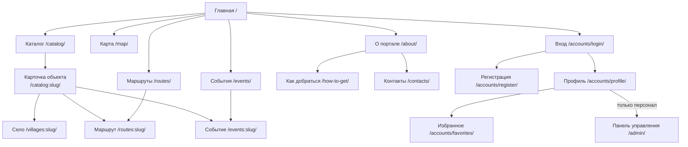

# Макеты интерфейса

## Карта сайта



## Главная

```
┌──────────────────────────────────────────────────────────────────┐
│ ⛰ Туризм округа   Каталог Карта Маршруты События О портале       │
│                                     [Русский ▾]  Вход  Регистрация│
├──────────────────────────────────────────────────────────────────┤
│                                                                  │
│  Отдых в Благовещенском округе          ┌──────┐┌──────┐         │
│  Базы отдыха и гостевые дома,           │  15  ││   9  │         │
│  приграничные смотровые точки,          │объект││ сёл  │         │
│  казачья история, пойма Амура…          └──────┘└──────┘         │
│                                         ┌──────┐┌──────┐         │
│  [Открыть каталог] [Смотреть на карте]  │   5  ││   7  │         │
│                                         │маршр.││событ.│         │
├──────────────────────────────────────────────────────────────────┤
│  Куда поехать                                                    │
│  ┌────┐┌────┐┌────┐┌────┐┌────┐┌────┐                            │
│  │ 🏡 ││ 🌾 ││ 🏛 ││ 🌉 ││ 🐝 ││ 🎪 │  ← категории со счётчиком   │
│  └────┘└────┘└────┘└────┘└────┘└────┘                            │
├──────────────────────────────────────────────────────────────────┤
│  Рекомендуем                                    [Все объекты]    │
│  ┌───────────┐ ┌───────────┐ ┌───────────┐                       │
│  │  фото     │ │  фото     │ │  фото     │                       │
│  │ Название ♥│ │ Название ♥│ │ Название ♥│                       │
│  │ 🏡 · село │ │ 🌉 · село │ │ 🌾 · село │                       │
│  │ описание  │ │ описание  │ │ описание  │                       │
│  │ [сезон] ★4│ │ [сезон]   │ │ [сезон] ★5│                       │
│  └───────────┘ └───────────┘ └───────────┘                       │
├──────────────────────────────────────────────────────────────────┤
│  Готовые маршруты          │  Ближайшие события                  │
│  ┌───────────────────────┐ │  ┌────┬─────────────────────┐       │
│  │ Название      [2 дня] │ │  │ 05 │ Реконструкция…      │       │
│  │ сезон · 5 точек       │ │  │сен │ Верхнеблаговещенское│       │
│  └───────────────────────┘ │  └────┴─────────────────────┘       │
└──────────────────────────────────────────────────────────────────┘
```

## Каталог

```
┌──────────────────────────────────────────────────────────────────┐
│  Каталог туристических объектов                                  │
│  ┌────────────────────────────────────────────────────────────┐  │
│  │ Поиск [__________]  Категория[▾] Село[▾] Сезон[▾] Сорт.[▾]│  │
│  │ [Показать] [Сбросить]                        [На карте]    │  │
│  └────────────────────────────────────────────────────────────┘  │
│  Найдено объектов: 15                                            │
│  ┌───────────┐ ┌───────────┐ ┌───────────┐                       │
│  │  карточка │ │  карточка │ │  карточка │                       │
│  └───────────┘ └───────────┘ └───────────┘                       │
│  ┌───────────┐ ┌───────────┐ ┌───────────┐                       │
│  │  карточка │ │  карточка │ │  карточка │                       │
│  └───────────┘ └───────────┘ └───────────┘                       │
│                    ‹ 1 2 ›                                       │
│                                                                  │
│  Рядом с округом                                                 │
│  Объекты регионального контекста: за границами округа            │
│  ┌───────────┐ ┌───────────┐                                     │
│  │ 📍 метка  │ │ 📍 метка  │                                     │
│  └───────────┘ └───────────┘                                     │
└──────────────────────────────────────────────────────────────────┘
```

## Карточка объекта

```
┌──────────────────────────────────────────────────────────────────┐
│  Главная / Каталог / База отдыха «Радуга»                        │
│  База отдыха «Радуга»                          [♥ В избранное]   │
│  [🏡 Базы отдыха] [📍 Натальино] [Круглый год]          ★ 4.5 (2)│
├────────────────────────────────────────┬─────────────────────────┤
│  ┌──────────────────────────────────┐  │ ┌─────────────────────┐ │
│  │            фото 16:9             │  │ │  На карте           │ │
│  └──────────────────────────────────┘  │ │  ┌───────────────┐  │ │
│  ┌──────┐┌──────┐┌──────┐              │ │  │   Leaflet     │  │ │
│  └──────┘└──────┘└──────┘              │ │  └───────────────┘  │ │
│                                        │ │  адрес, координаты  │ │
│  Описание объекта в несколько          │ └─────────────────────┘ │
│  абзацев…                              │ ┌─────────────────────┐ │
│                                        │ │ Входит в маршруты   │ │
│  ┃ Примечание о достоверности          │ │ → Природа поймы     │ │
│                                        │ └─────────────────────┘ │
│  #баня #рыбалка #семейный отдых        │ ┌─────────────────────┐ │
│  ────────────────────────────────      │ │ События на площадке │ │
│  Отзывы (2)                            │ └─────────────────────┘ │
│  Мария Иванова              ★★★★★      │ ┌─────────────────────┐ │
│  12.08.2026                            │ │ Рядом               │ │
│  Ездили семьёй на выходные…            │ └─────────────────────┘ │
│  ┌──────────────────────────────────┐  │                         │
│  │ Оставить отзыв                   │  │                         │
│  │ Оценка ○1 ○2 ○3 ○4 ●5            │  │                         │
│  │ [текст………………]  [Отправить]      │  │                         │
│  │ Отзыв появится после проверки.   │  │                         │
│  └──────────────────────────────────┘  │                         │
└────────────────────────────────────────┴─────────────────────────┘
```

## Карта

```
┌──────────────────────────────────────────────────────────────────┐
│  Карта туристических объектов                                    │
│  ┌────────────┐ ┌───────────────────────────────────────────┐    │
│  │ Категории  │ │                                           │    │
│  │ ☑ 🏡 Базы  │ │        ●                    ●             │    │
│  │ ☑ 🌾 Приро.│ │              ●        ●                   │    │
│  │ ☑ 🏛 Истор.│ │        ┌──────────────┐                   │    │
│  │ ☑ 🌉 Пригр.│ │     ●  │ Название     │      ●            │    │
│  │ ☑ 🐝 Агро  │ │        │ село         │                   │    │
│  │ ☑ 🎪 Событ.│ │        │ Подробнее →  │                   │    │
│  │            │ │        └──────────────┘                   │    │
│  │ Координаты │ │                          © OpenStreetMap  │    │
│  │ приблизит. │ └───────────────────────────────────────────┘    │
│  └────────────┘                                                  │
└──────────────────────────────────────────────────────────────────┘
```

## Маршрут

```
┌──────────────────────────────────────────────────────────────────┐
│  Приграничный маршрут выходного дня                              │
│  [⏱ 2 дня] [Круглый год] [Лёгкий] [5 точек]                      │
├────────────────────────────────────────┬─────────────────────────┤
│  Описание маршрута…                    │ ┌─────────────────────┐ │
│                                        │ │ Маршрут на карте    │ │
│  Программа                             │ │  ①──②               │ │
│  ①  Мост Благовещенск — Хэйхэ      ♥   │ │      ╲              │ │
│  │   🌉 Приграничье · Каникурган       │ │       ③──④          │ │
│  │   Смотровая точка, 30–40 минут      │ │           ╲         │ │
│  ②  Пункт пропуска «Кани-Курган»   ♥   │ │            ⑤        │ │
│  │   Обзорно, с дороги                 │ └─────────────────────┘ │
│  ③  Смотровая на Амур              ♥   │                         │
│  ④  Памятник казакам               ♥   │                         │
│  ⑤  Гостевые дома в Чигирях        ♥   │                         │
└────────────────────────────────────────┴─────────────────────────┘
```

## Календарь событий

```
┌──────────────────────────────────────────────────────────────────┐
│  Календарь событий округа                                        │
│  ┌────────────────────────────────────────────────────────────┐  │
│  │ Месяц [▾]  Село [▾]  ☐ Показать прошедшие     [Показать]   │  │
│  └────────────────────────────────────────────────────────────┘  │
│  ┌────┬───────────────────────────┐ ┌────┬──────────────────┐    │
│  │ 05 │ Реконструкция «Амурское…» │ │ 20 │ Ярмарка фермеров │    │
│  │сен │ 05.09–06.09 · Верхнеблаг. │ │сен │ 20.09 · Марково  │    │
│  └────┴───────────────────────────┘ └────┴──────────────────┘    │
└──────────────────────────────────────────────────────────────────┘
```

## Адаптивность

При ширине экрана меньше 992 px меню сворачивается в «бургер», колонки
выстраиваются в одну, карточки идут по одной в ряд, карта уменьшается до
380 px по высоте. Проверять удобно в режиме мобильного устройства браузера
(F12 → Toggle device toolbar).

## Палитра и типографика

| Назначение | Значение |
|---|---|
| Основной цвет | `#17624a` (тёмно-зелёный, тайга) |
| Тёмный оттенок | `#0f4635` |
| Светлая подложка | `#e8f2ee` |
| Акцент | `#c26a1f` (охра, примечания) |
| Фон страницы | `#f6f8f7` |
| Текст | `#1d2321` |
| Шрифт | системный (Segoe UI / Noto Sans / system-ui) |
| Радиус скругления | 14 px |

Цвет каждой категории задаётся в справочнике `data/categories.json` и
используется и в маркерах карты, и в изображениях-заглушках.
